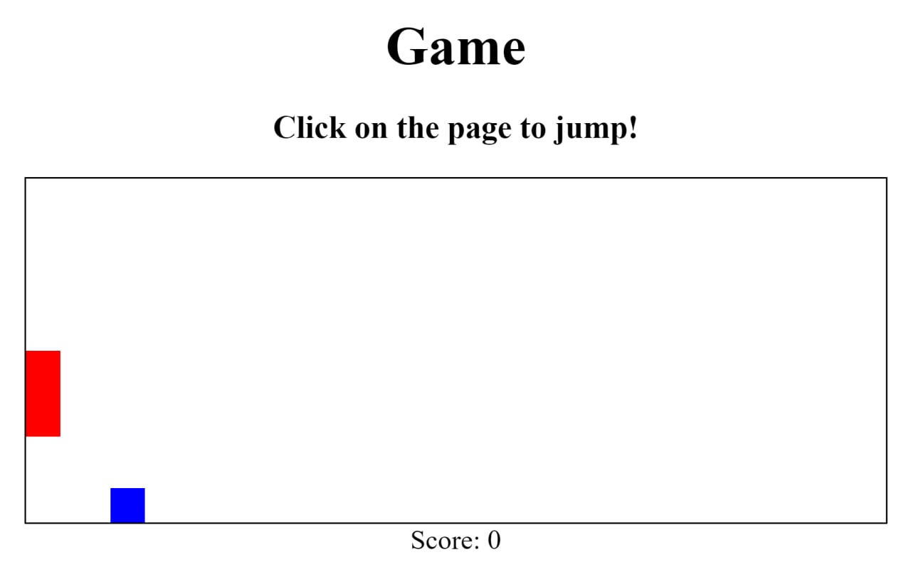

# Easiest JS Game

The easiest game you can design by JavaScript. Similar to Dinosaur Game but it's much simpler and you have to jump near obstacles.

You are a hard player? bet to get your highest **SCORE**.

**Demo:** https://basemax.github.io/easiest-js-game/

I do not remember the source link, But I get the main idea from a video.
